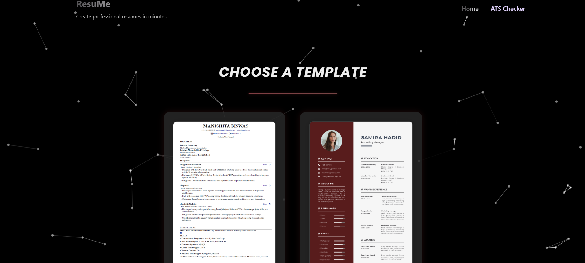
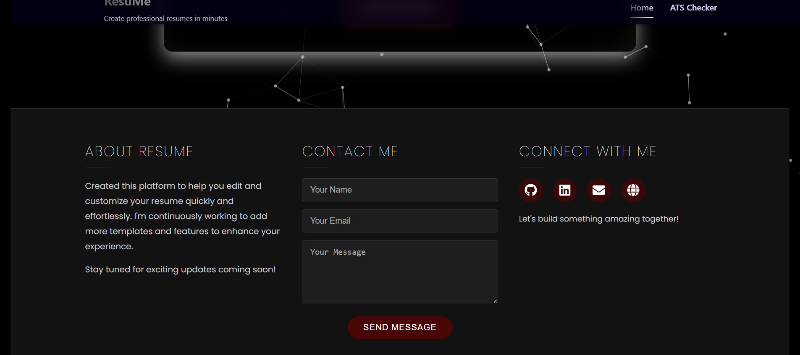
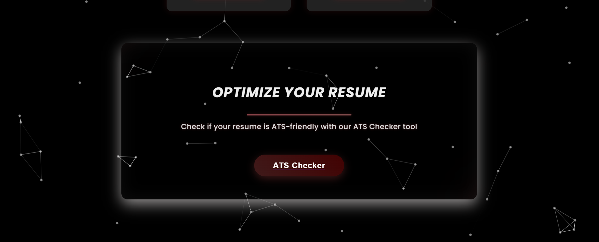
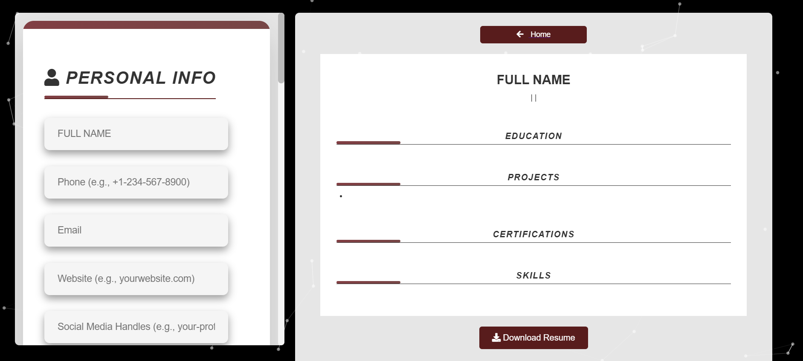
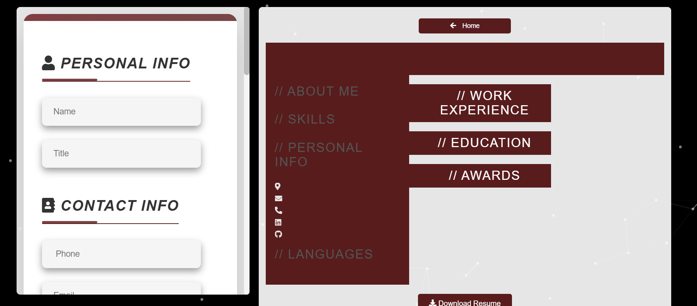
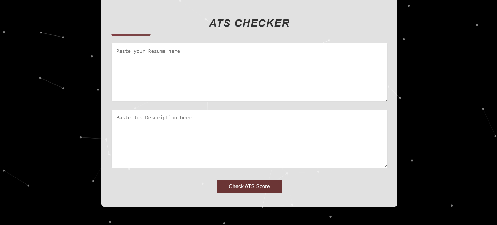

# ResuMe 

**ResuMe** is a dynamic resume builder web app that allows users to create professional resumes using customizable templates and evaluate their resume against job descriptions using an ATS (Applicant Tracking System) Checker.

---

##  Features

- Build resumes using **two different templates**
- Real-time preview of the resume
- dd/edit/remove sections like Skills, Education, Certificates, Languages, and Experience
- Intelligent **ATS Checker** to analyze keyword matching with job descriptions
- Animated background for a modern and engaging UI

---

## 🛠 Tech Stack

- **Frontend**: React, CSS,SweetAlert2 for alert modals and confirmations (install via npm install sweetalert2 and use inside components)
- **Routing**: React Router
- **Animations**: AOS (Animate On Scroll) and CSS-based animations
- **Deployment**: Vercel

---
### HomePage 


### Footer
 

 ### Optimize Your Resume
 

###  First Template 


### Second Template 


###  ATS Tracker



## 🔧 Getting Started

To run the project locally:

```bash
git clone https://github.com/imanishita/ResuMe.git
cd ResuMe
npm install
npm start
